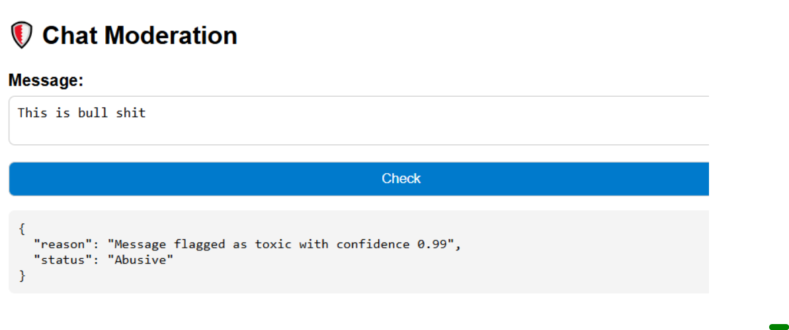
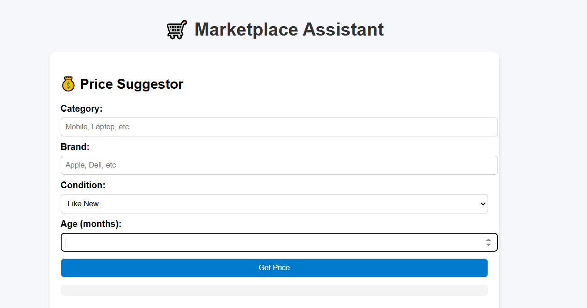

# 🛍️ AI Marketplace Assistant

An AI-powered assistant for second-hand marketplaces that helps buyers
and sellers with:

-   💰 **Price Suggestions** → Fair price estimation for second-hand
    products.\
-   🛡️ **Chat Moderation** → Detects abusive/spam messages using Hugging
    Face toxic comment classifiers.

Built with **Flask**, **Pandas**, **Hugging Face Transformers**, and a
simple **Bootstrap frontend**.

------------------------------------------------------------------------

## 🚀 Features

### 🔹 Price Suggestor

-   Inputs: Category, Brand, Condition, Age (months).\
-   Logic: Adjusts fair price range using depreciation & product
    condition.\
-   Output: JSON with `fair_price_range` and `reasoning`.

### 🔹 Chat Moderation

-   Inputs: Buyer/Seller message.\
-   Uses Hugging Face model:
    [`unitary/toxic-bert`](https://huggingface.co/unitary/toxic-bert).\
-   Detects: Toxic / Safe messages with confidence score.\
-   Output: JSON with `status` and `reason`.

------------------------------------------------------------------------

## 🖼️ Screenshots

### 🛡️ Chat Moderation



### 💰 Price Suggestor



------------------------------------------------------------------------

## 🛠️ Tech Stack

-   **Backend**: Flask (Python)\
-   **Frontend**: HTML + CSS (Bootstrap)\
-   **AI Models**: Hugging Face `unitary/toxic-bert`\
-   **Dataset**: CSV with product details

------------------------------------------------------------------------

## 📂 Project Structure

    marketplace-assistant/
    │── app.py                # Flask app entry
    │── agents/
    │   ├── price_agent.py    # Price Suggestor logic
    │   ├── moderation_agent.py # Hugging Face Toxicity Model
    │── static/
    │   ├── style.css         # Custom CSS
    │── templates/
    │   ├── index.html        # Price Suggestor UI
    │   ├── moderation.html   # Chat Moderation UI
    │── data/
    │   ├── products.csv      # Dataset
    │── README.md             # Documentation
    │── requirements.txt      # Dependencies

------------------------------------------------------------------------

## ⚙️ Setup Instructions

### 1️⃣ Clone Repo

``` bash
git clone https://github.com/your-username/marketplace-assistant.git
cd marketplace-assistant
```

### 2️⃣ Install Dependencies

``` bash
pip install -r requirements.txt
```

### 3️⃣ Run App

``` bash
python app.py
```

### 4️⃣ Open in Browser

Navigate to:\
👉 <http://127.0.0.1:5000>

------------------------------------------------------------------------

## 📌 API Endpoints

### 🔹 Price Suggestor

**POST** `/negotiate`

``` json
{
  "category": "Mobile",
  "brand": "Apple",
  "condition": "Good",
  "age_months": 24
}
```

➡️ Returns:

``` json
{
  "fair_price_range": "₹24,000 - ₹28,000",
  "reasoning": "Phones older than 24 months usually lose 35-45% of their original value."
}
```

------------------------------------------------------------------------

### 🔹 Chat Moderation

**POST** `/moderate`

``` json
{ "message": "This is bull shit" }
```

➡️ Returns:

``` json
{
  "status": "Abusive",
  "reason": "Message flagged as toxic with confidence 0.99"
}
```

------------------------------------------------------------------------

